  <picture>
    <source media="(prefers-color-scheme: dark)" srcset="./dark.svg">
    <source media="(prefers-color-scheme: light)" srcset="./light.svg">
    
  </picture>

---

## GitHub Stats

  
  

---

## Contribution Activity

  

---

## Connect

  
  

